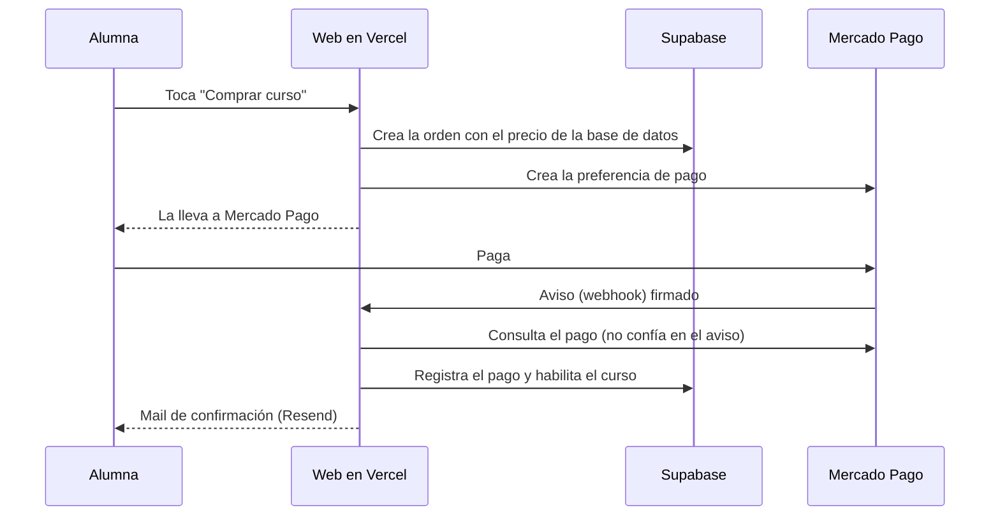

# IA NAILS — plataforma de cursos online

Sitio web de **Iara (IA NAILS)** para vender y entregar cursos online de uñas: catálogo, cuentas de alumnas, pago con Mercado Pago, acceso automático al curso, clases con video y botón de arrepentimiento.

- **Sitio de pruebas:** https://ia-nails-lpwe.vercel.app (con bloqueo de buscadores hasta el lanzamiento)
- **Repositorio:** github.com/Luisrojas1811/ia-nails

## Stack
| Pieza | Para qué |
|---|---|
| **Next.js 16** (App Router) + TypeScript | La web y su servidor |
| **Tailwind CSS 4** | Estilos (colores y tipografías en `src/app/globals.css`) |
| **Supabase** | Cuentas de usuarias y base de datos Postgres con reglas de seguridad (RLS) |
| **Mercado Pago** (Checkout Pro) | Cobro y avisos de pago (webhook) |
| **Bunny Stream** | Videos con links firmados |
| **Resend** | Mails automáticos |
| **Vercel** | Hosting del sitio |
| **Vitest** + GitHub Actions | Tests y revisión automática en cada subida |

## Cómo correrlo en tu computadora
Requisitos: **Node.js 24 (LTS)** y **Git**.

```
git clone https://github.com/Luisrojas1811/ia-nails.git
cd ia-nails
npm install
Copy-Item .env.example .env.local     # en Windows PowerShell; completar los valores
npm run dev                            # http://localhost:3000
```

Sin claves de Supabase la web igual abre: las cuentas, los pagos y los mails responden con un aviso en vez de fallar.

## Comandos
| Comando | Qué hace |
|---|---|
| `npm run dev` | Servidor de desarrollo |
| `npm test` | Todos los tests (tienen que pasar antes de subir cambios) |
| `npm run lint` | Revisión de estilo del código |
| `npm run typecheck` | Revisión de tipos |
| `npm run build` | Compila para producción |
| `npm run check:launch` | Lista los datos `[[PENDIENTE]]` que faltan en los textos legales |

## Estructura
```
src/
  app/                  Páginas y rutas (Next.js)
    (auth)/             Ingresar, registro, recuperar y cambiar contraseña
    api/webhooks/       Aviso de Mercado Pago (valida la firma y habilita el curso)
    arrepentimiento/    Botón de arrepentimiento (no pide cuenta)
    cursos/[slug]/      Página de venta de cada curso + botón de compra
    mis-cursos/         Cursos comprados, clases con video y progreso
    terminos, privacidad, devoluciones/   Textos legales
    robots.ts, sitemap.ts   Reglas para buscadores y mapa del sitio
  components/           Piezas de interfaz (carrusel, tarjetas, formularios)
  content/legal.ts      Textos legales (los datos que faltan van como [[PENDIENTE: ...]])
  lib/
    courses.ts          Catálogo que se MUESTRA en el sitio (ver "Precios")
    site.ts             Datos del negocio: contacto, horarios, menú
    works.ts            Fotos de trabajos (galería y carrusel)
    payments/           Lógica de pagos (idempotente y con tests)
    mercadopago/        Cliente de la API y validación de firma
    supabase/           Conexión a la base y control de sesión
    email/              Envío (Resend), plantillas y avisos
supabase/
  migrations/           Esquema de la base, en orden. Se aplican a mano en el SQL Editor
  seed.sql              Cursos iniciales
  demo-lessons.sql      Clases de ejemplo (para pruebas; se borran después)
docs/                   Guías de configuración y operación (ver abajo)
public/images/          Logo, portadas de cursos y fotos
```

## Cómo se compra un curso

Reglas que no se rompen: el acceso a un curso depende **solo** de la tabla `enrollments`; los pagos y las inscripciones los escribe **solo el servidor**; el aviso de Mercado Pago es idempotente (se puede repetir sin duplicar nada); un mail que falla nunca frena una compra.

## Variables de entorno
Se cargan en `.env.local` (computadora) y en Vercel → Settings → Environment Variables (**después de cambiarlas hay que hacer Redeploy**). El archivo `.env.local` **nunca** se sube a GitHub.

| Variable | Qué es | Es secreta |
|---|---|---|
| `NEXT_PUBLIC_SUPABASE_URL` | Dirección del proyecto de Supabase | No |
| `NEXT_PUBLIC_SUPABASE_PUBLISHABLE_KEY` | Clave pública de Supabase | No |
| `SUPABASE_SECRET_KEY` | Clave con control total de la base | **Sí** |
| `NEXT_PUBLIC_SITE_URL` | Dirección pública del sitio, sin barra final | No |
| `ALLOW_INDEXING` | `true` deja entrar a Google (solo en Production; los despliegues de prueba nunca se indexan) | No |
| `NEXT_PUBLIC_CHECKOUT_ENABLED` | `true` activa el botón de compra | No |
| `MP_ACCESS_TOKEN` | Credencial de Mercado Pago (de prueba o de producción) | **Sí** |
| `MP_WEBHOOK_SECRET` | Clave para validar los avisos de Mercado Pago | **Sí** |
| `MP_USE_SANDBOX` | `true` usa la URL de pago de pruebas (solo si hace falta) | No |
| `BUNNY_STREAM_LIBRARY_ID` | Número de la biblioteca de videos | No |
| `BUNNY_STREAM_TOKEN_AUTH_KEY` | Clave para firmar los links de video | **Sí** |
| `RESEND_API_KEY` | Clave de Resend para mandar mails | **Sí** |
| `EMAIL_FROM` | Remitente de los mails (dominio verificado) | No |
| `NOTIFY_EMAIL` | Mail que recibe los avisos internos | No |

## Cómo se publica
- Cada `git push` a `main` dispara el CI de GitHub (lint, tipos, tests y build) y un despliegue en Vercel.
- Para cambios grandes conviene una rama (`git checkout -b feat/lo-que-sea`): Vercel genera un link de prueba y se pasa a `main` solo cuando está bien.
- Los cambios en la base de datos van como archivos nuevos en `supabase/migrations/` (nunca se edita uno ya aplicado) y se corren en el SQL Editor de Supabase, en orden.

## Guías
| Guía | Para qué |
|---|---|
| [`docs/OPERACION.md`](docs/OPERACION.md) | Tareas del día a día y qué hacer cuando algo falla |
| [`docs/LANZAMIENTO.md`](docs/LANZAMIENTO.md) | Lista de verificación antes de salir en vivo |
| [`docs/AUTH_SETUP.md`](docs/AUTH_SETUP.md) | Configurar las cuentas en Supabase |
| [`docs/PAYMENTS_SETUP.md`](docs/PAYMENTS_SETUP.md) | Configurar y probar Mercado Pago |
| [`docs/VIDEOS_SETUP.md`](docs/VIDEOS_SETUP.md) | Configurar Bunny y cargar videos |
| [`docs/EMAIL_SETUP.md`](docs/EMAIL_SETUP.md) | Configurar Resend y los mails |

## Límites conocidos
- **No hay panel de administración:** los cursos, clases y videos se cargan con comandos SQL (están en `docs/`). Es parte de la etapa 2.
- **Los precios viven en dos lugares:** el que se muestra (`src/lib/courses.ts`) y el que se cobra (tabla `courses`). Un test verifica que `seed.sql` coincida con el catálogo, pero **la base real hay que actualizarla a mano** (ver `docs/OPERACION.md`).
- **El certificado virtual** no se genera automáticamente.
- **Sin captcha** en el botón de arrepentimiento todavía.
